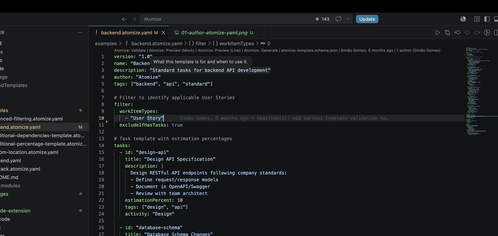
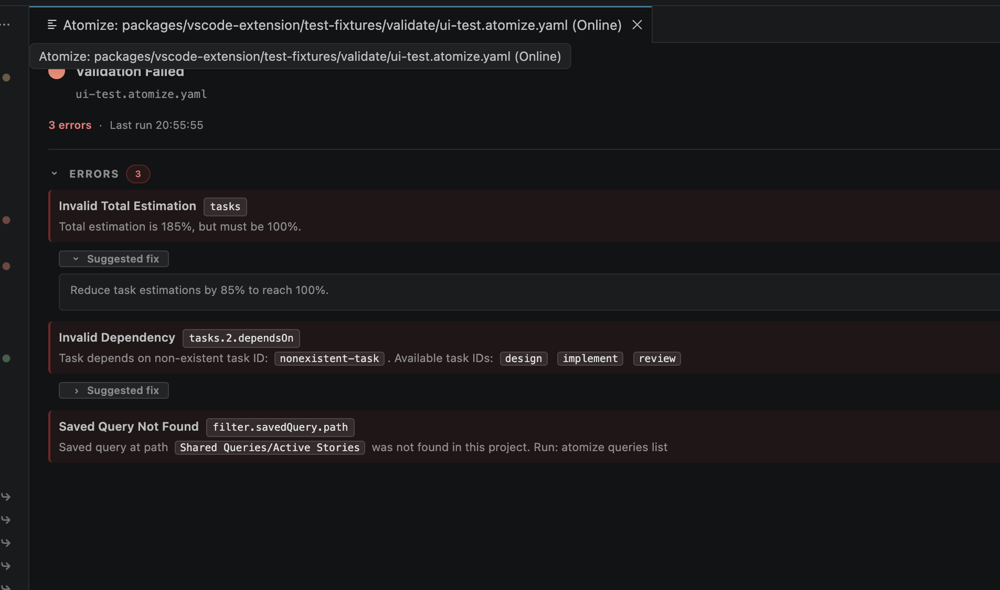
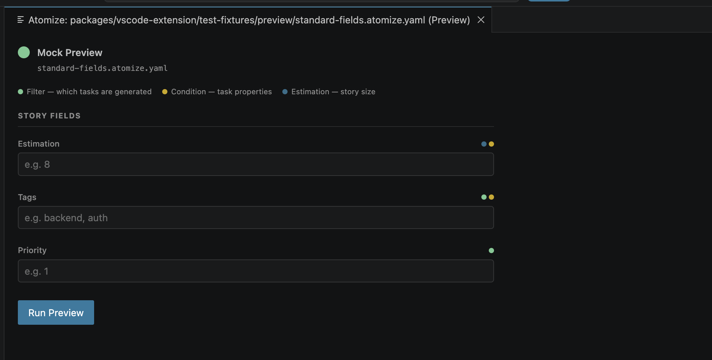
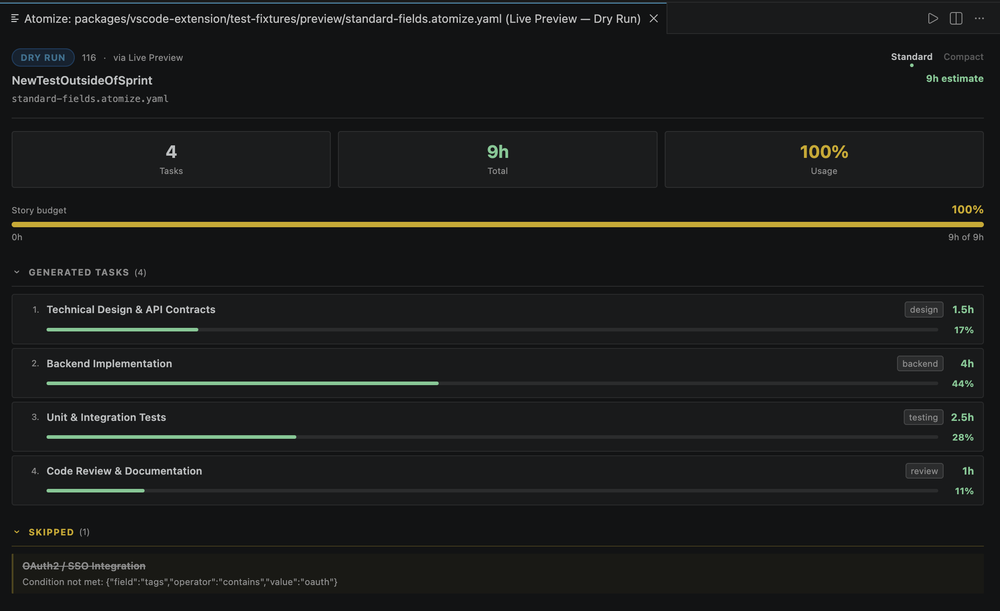
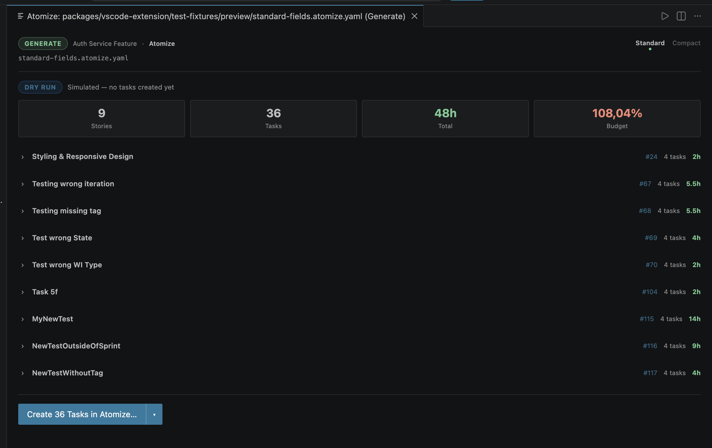

# Atomize for VS Code

Preview and generate repeatable task breakdowns from reusable YAML templates inside VS Code.

Atomize helps teams turn stories into consistent child tasks. Author Atomize YAML files with schema completions, validate them, preview the task plan, and generate tasks only after an explicit confirmation step.

> Compatibility: Atomize is designed around platform adapters. Today, connected generation supports Azure DevOps. Mock is available for offline testing.

## First Workflow

1. Open or create an Atomize YAML file.
2. Run **Atomize: Validate** to check the template.
3. Run **Atomize: Preview (Mock)** to simulate generated tasks without connecting to a platform.
4. Configure a Connection Profile with **Atomize: Manage Profiles** when you are ready to use connected workflows.
5. Run **Atomize: Preview (Live)** to preview against a real Story.
6. Run **Atomize: Generate** to review the plan and create Tasks only after confirmation.

Atomize previews by default. Creating Tasks requires the Generate flow and an explicit confirmation.

## Atomize YAML

Use `.atomize.yaml` or `.atomize.yml` for the full editor experience: CodeLens actions, save-time diagnostics, schema hovers, completions, and snippets.

You can also add `# atomize-yaml` on the first line of a regular YAML file. The extension may identify matching YAML content during a session, but a durable marker is recommended for team templates.

Atomize YAML files stay on VS Code's YAML language service for schema-backed hovers and completions. The extension pack installs the Red Hat YAML extension for this.

```yaml
version: "1.0"
name: "Feature Breakdown"

filter:
  workItemTypes: ["Story"]

tasks:
  - title: "Design: ${story.title}"
    estimationPercent: 20
  - title: "Build: ${story.title}"
    estimationPercent: 60
  - title: "Validate: ${story.title}"
    estimationPercent: 20
```

## Commands

- **Atomize: Validate** checks the active Template and opens a Validation Report for explicit runs.
- **Atomize: Preview (Mock)** runs an offline Mock Preview from entered Story fields.
- **Atomize: Preview (Live)** runs a connected dry run against a real Story.
- **Atomize: Generate** previews the generation result, then creates Tasks only after confirmation.
- **Atomize: Manage Profiles** adds, tests, rotates, removes, and selects Connection Profiles.
- **Atomize: Browse Catalog** opens Templates and Mixins from the Template Library.
- **Atomize: Browse Fields** looks up platform fields for a selected Connection Profile.
- **Atomize: Browse Queries** looks up saved queries for a selected Connection Profile.
- **Atomize: Show Effective Template** opens the fully Resolved Template.
- **Atomize: Open Settings** opens extension settings.

For durable Atomize YAML files, the main file actions also appear as CodeLens commands at the top of the editor.

## Validation And Preview

**Offline Validation** checks Template structure without credentials.

**Online Validation** uses a Connection Profile to verify platform-specific fields and query references. The extension always asks which profile to use before an explicit validation run. A workspace default profile may preselect an item, but it does not run connected validation silently.

**Mock Preview** does not connect to a platform and does not create Tasks.

**Live Preview** reads a real Story through a Connection Profile and shows the generated task breakdown as a dry run. It does not create Tasks.

## Connection Profiles

Run **Atomize: Manage Profiles** to add, test, rotate, remove, or set a default Connection Profile.

The extension owns profile storage: non-secret fields (name, organization URL, project, team) live in VS Code's extension state and tokens live in VS Code Secret Storage. Nothing is shared with the Atomize CLI.

If you used the Atomize CLI before adopting the extension, the profile picker's empty state offers a one-time **Import from CLI** action that pre-fills the Add Profile form from `~/.atomize/connections.json` (read-only, never written to). You re-enter each token once during import.

For credential scopes and platform-specific setup, see the [Auth Guide](https://github.com/Simao-Pereira-Gomes/atomize/blob/main/docs/Auth-Guide.md).

## Settings

- `atomize.defaultProfile`: workspace-scoped profile name to preselect in the Validate, Live Preview, and Generate pickers.
- `atomize.previewLayout`: preview panel layout, either `default` or `compact`.

> Upgrading from an earlier version? The `atomize.cliPath`, `atomize.cli.installCommand`, and `atomize.cli.autoCheckUpdates` settings are deprecated no-ops. The extension shows a one-time notice if any are still set, and you can safely remove them.

## Documentation

- [VS Code Extension Guide](https://github.com/Simao-Pereira-Gomes/atomize/blob/main/docs/VS-Code-Extension.md)
- [Documentation Index](https://github.com/Simao-Pereira-Gomes/atomize/blob/main/docs/README.md)
- [Workflows](https://github.com/Simao-Pereira-Gomes/atomize/blob/main/docs/Workflows.md)
- [Template Creation](https://github.com/Simao-Pereira-Gomes/atomize/blob/main/docs/Template-Creation.md)
- [Template Reference](https://github.com/Simao-Pereira-Gomes/atomize/blob/main/docs/Template-Reference.md)
- [Validation Modes](https://github.com/Simao-Pereira-Gomes/atomize/blob/main/docs/Validation-Modes.md)
- [CLI Reference](https://github.com/Simao-Pereira-Gomes/atomize/blob/main/docs/Cli-Reference.md)

## Screenshots

### Author Atomize YAML



### Validate Templates



### Preview With Mock Data



### Preview A Live Story



### Generate After Confirmation


